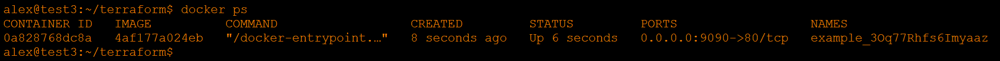
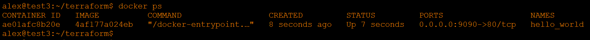
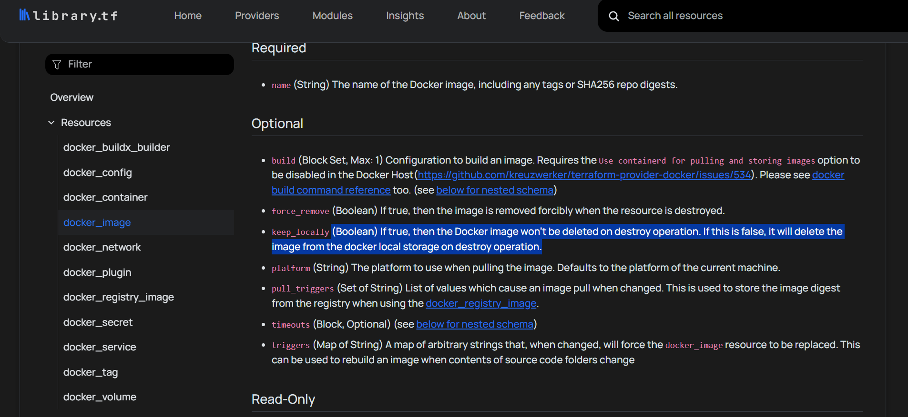

# Домашнее задание к занятию «Введение в Terraform» - Хрипун Алексей

### Задание 1

Исходя из содержимого файла .gitignore, допустимо сохранить секреты в файле personal.auto.tfvars.

В state-файле значение созданного ресурса random_password  - "result": "3Oq77Rhfs6Imyaaz"

В файле main.tf допущено несколько ошибок:
* не указано имя ресурса - nginx
* имя ресурса указано неверно - имя не может начинаться с цифры
* некорректно указана строка random_password.random_string.result

После запуска кода :



Чтобы изменить имя контейнера нужно в ресурсе контейнера resource "docker_container" указать другой name:



Ключ **terraform apply -auto-approve** немедленно применеят изменения, лишая возможности проверить, что будет изменено, план выполнения будет пропущен. Этот ключ может быть полезен при автоматизации. Ключ потенциально опасный, т.к. без этого ключа можно просмотреть вносимые изменения, и если что-то не так, отменить операцию применения.

Уничтожить все созданные ресурсы можно командой **terraform destroy**. После применения этой команды файл terraform.tfstate будет иметь вид:
```
{
  "version": 4,
  "terraform_version": "1.14.3",
  "serial": 11,
  "lineage": "30ad7666-9f1a-5f29-3341-efc91a57f1ea",
  "outputs": {},
  "resources": [],
  "check_results": null
}
```
Т.к. в ресурсе docker_image указана опция keep_locally = true, то при выполнении команды terraform destroy Docker-образ удален не будет:



